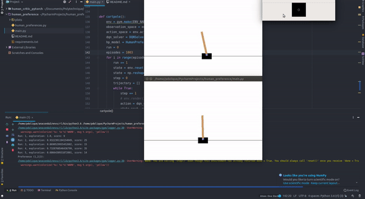
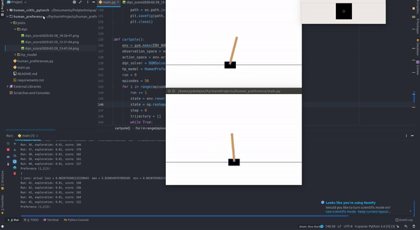
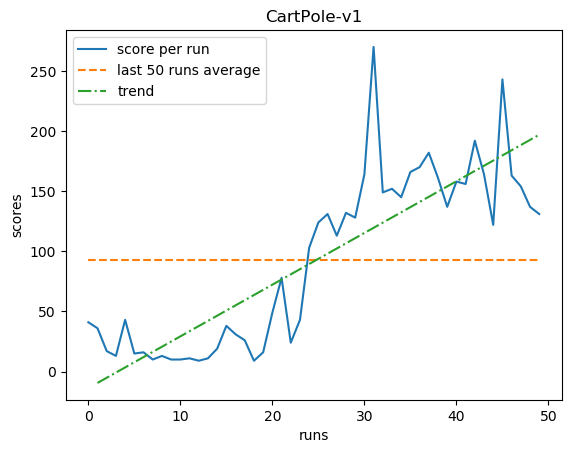
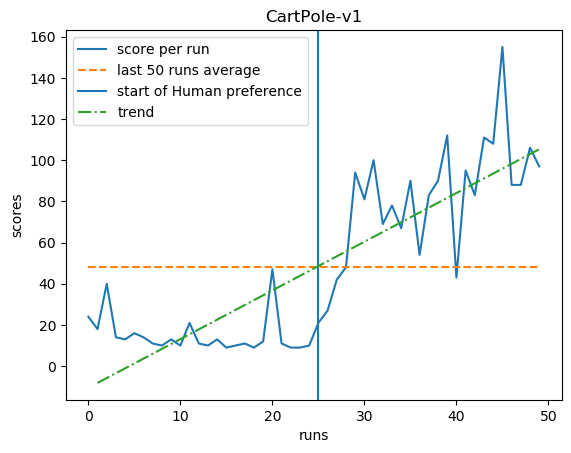

# Deep Reinforcement Learning from Human preferences

The goal of this project is to implement a small example to illustrate this paper: 
[Deep reinforcement learning from human preferences](https://arxiv.org/pdf/1706.03741.pdf). For this pupose we use the 
CartPole environment from [Gym](https://gym.openai.com/), for its ease to use and to implement. Moreover it can run  on 
a rather small computer and doesn't require a GPU.

## Training

Use the script [main.py](main.py) to train the model.

You can either train it with default reward or train  another model in parallele to predict a reward based on 
human choice. When this last option is chosen, during the training, the user has to decide between two simulations which 
one is the best by entering either 1, 2 or 3 (if both simulation are similar). The human choice for the reward is taken 
into account from half of the total number of episodes.

Here examples of training with human preferences:

## Results

Training without human preferences:

training with human preferences:

The results with human choice are limitated by the fact that the default reward for the cartpole are already very effective
and the human intervention doesn't really benefit this environment.

## References

[https://github.com/gsurma/cartpole/blob/master/cartpole.py](https://github.com/gsurma/cartpole/blob/master/cartpole.py)

[https://github.com/ZachisGit/LearningFromHumanPreferences](https://github.com/ZachisGit/LearningFromHumanPreferences)
